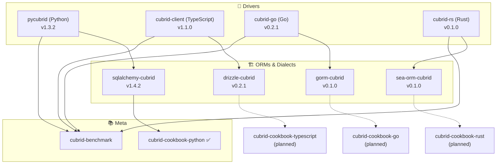
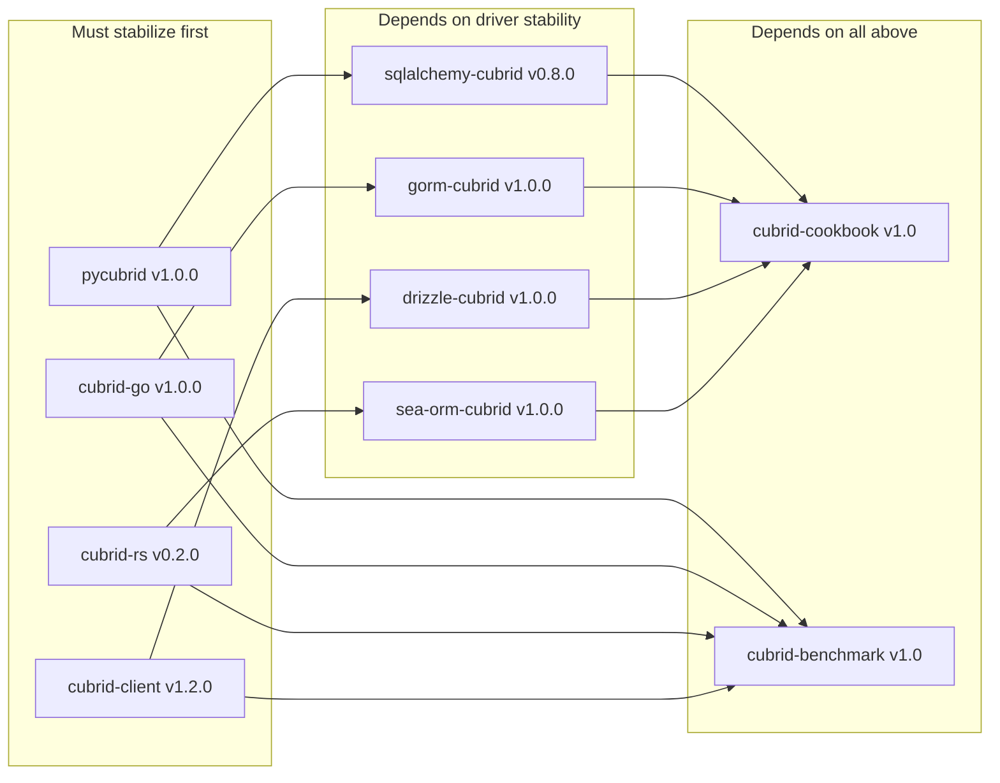

# CUBRID Labs — Ecosystem Roadmap

> **Last updated**: 2026-05-01
>
> This is the unified roadmap for the cubrid-labs ecosystem.
> Milestones are authoritative for "next release" scope.
> This document is authoritative for direction, priorities, and cross-repo dependencies.
>
> 📋 [**Org Project Board**](https://github.com/orgs/cubrid-labs/projects/2) · See [individual repo milestones](#release-focus-by-repo) for execution details.

---

## Ecosystem Map

---

## Now / Next / Later

### 🟢 Now (Current Focus)

- **cubrid-cookbook-python ✅ COMPLETE** — 55+ production-ready recipes (pycubrid, SQLAlchemy, Pandas, Flask, FastAPI, Streamlit, Django). Tested on CUBRID 11.2 + 11.4. [Support Matrix](https://github.com/cubrid-lab/cubrid-cookbook-python/blob/main/SUPPORT_MATRIX.md)
- **Python driver improvements** — pycubrid v1.3.2 (DATETIMETZ, error hints for reserved words/CARDINALITY); sqlalchemy-cubrid v1.4.2 (DateTime timezone DDL, CARDINALITY CompileError)
- **Performance profiling & optimization** — Python driver optimized (19% fetch improvement); query compilation cache added to sqlalchemy-cubrid. Ongoing: further gap reduction vs MySQL.
- **Benchmark automation** — Nightly CI runs with extended workloads (connect/disconnect, prepared statements, batch insert, concurrent select)
- **cubrid-rs protocol completion** — Broker handshake, authentication, query execution (v0.2.0)

### 🟡 Next (1–3 Months)

- **Language-specific cookbooks** — TypeScript (cubrid-cookbook-typescript), Go (cubrid-cookbook-go), Rust (cubrid-cookbook-rust) following the Python cookbook pattern
- **v1.0 stabilization** — API freeze for cubrid-go, gorm-cubrid, drizzle-cubrid
- **Connection resilience** — Retry policies, connection health checks (cubrid-client v1.2.0)
- **Registry publishing** — crates.io (cubrid-rs, sea-orm-cubrid); PyPI Trusted Publisher configured ✅ (pycubrid v1.3.2, sqlalchemy-cubrid v1.4.2 published)

### 🔵 Later (3–6 Months)

- **JSON type mapping** — CUBRID supports JSON since 10.2; map in sqlalchemy-cubrid, pycubrid, cubrid-client
- **Async driver for Rust** — cubrid-tokio with backpressure handling (cubrid-rs v0.5.0)
- **Connection pool crates** — cubrid-pool for Rust (cubrid-rs v0.6.0)
- **Full SeaORM feature parity** — Entity generation, migrations, crates.io availability
- **Ecosystem documentation portal** — Unified docs site (GitHub Pages)

---

## Dependency Graph

---

## Release Focus by Repo

| Repo | Next Milestone | Focus | Link |
|------|---------------|-------|------|
| **pycubrid** | v1.3.2 ✅ | Error hints, DATETIMETZ, async driver | [Releases](https://github.com/cubrid-lab/pycubrid/releases) |
| **pycubrid** | [v2.0.0](https://github.com/cubrid-lab/pycubrid/milestone/1) | Stable release — full PEP 249, connection pooling | [Milestones](https://github.com/cubrid-lab/pycubrid/milestones) |
| **sqlalchemy-cubrid** | v1.4.2 ✅ | DateTime timezone, CARDINALITY CompileError, reserved word docs | [Releases](https://github.com/cubrid-lab/sqlalchemy-cubrid/releases) |
| **sqlalchemy-cubrid** | [v2.0.0](https://github.com/cubrid-lab/sqlalchemy-cubrid/milestone/2) | SA 2.2 support, JSON type mapping | [Milestones](https://github.com/cubrid-lab/sqlalchemy-cubrid/milestones) |
| **cubrid-client** | [v1.2.0](https://github.com/cubrid-lab/cubrid-client/milestone/1) | Reliability & performance | [Milestones](https://github.com/cubrid-lab/cubrid-client/milestones) |
| **drizzle-cubrid** | [v1.0.0](https://github.com/cubrid-lab/drizzle-cubrid/milestone/1) | Stable release | [Milestones](https://github.com/cubrid-lab/drizzle-cubrid/milestones) |
| **cubrid-go** | [v1.0.0](https://github.com/cubrid-lab/cubrid-go/milestone/1) | Stable release | [Milestones](https://github.com/cubrid-lab/cubrid-go/milestones) |
| **gorm-cubrid** | [v1.0.0](https://github.com/cubrid-lab/gorm-cubrid/milestone/1) | Stable release | [Milestones](https://github.com/cubrid-lab/gorm-cubrid/milestones) |
| **cubrid-rs** | [v0.2.0](https://github.com/cubrid-lab/cubrid-rs/milestone/1) | Protocol completeness | [Milestones](https://github.com/cubrid-lab/cubrid-rs/milestones) |
| **cubrid-rs** | [v1.0.0](https://github.com/cubrid-lab/cubrid-rs/milestone/2) | Stable release | [Milestones](https://github.com/cubrid-lab/cubrid-rs/milestones) |
| **sea-orm-cubrid** | [v1.0.0](https://github.com/cubrid-lab/sea-orm-cubrid/milestone/1) | Stable release | [Milestones](https://github.com/cubrid-lab/sea-orm-cubrid/milestones) |
| **cubrid-cookbook-python** | ✅ Complete | 55+ recipes, tested CUBRID 11.2+11.4 | [Repo](https://github.com/cubrid-lab/cubrid-cookbook-python) |
| **cubrid-benchmark** | [v1.0](https://github.com/cubrid-labs/cubrid-benchmark/milestone/1) | Comprehensive benchmarks | [Milestones](https://github.com/cubrid-labs/cubrid-benchmark/milestones) |

---

## Contributing

We welcome contributions to any repo in the ecosystem!

- 🐛 **Found a bug?** Open an issue on the relevant repo
- 💡 **Have a feature idea?** Start a [Discussion](https://github.com/orgs/cubrid-labs/discussions)
- 🔧 **Want to contribute code?** See [CONTRIBUTING.md](CONTRIBUTING.md) and look for `good first issue` labels
- 📋 **Track progress**: [Org Project Board](https://github.com/orgs/cubrid-labs/projects/2)

---

> **Disclaimer**: This roadmap reflects current intentions and priorities. Timelines and scope may change based on community feedback, contributor availability, and technical discoveries. Milestones on individual repos are the most up-to-date source for release planning.
